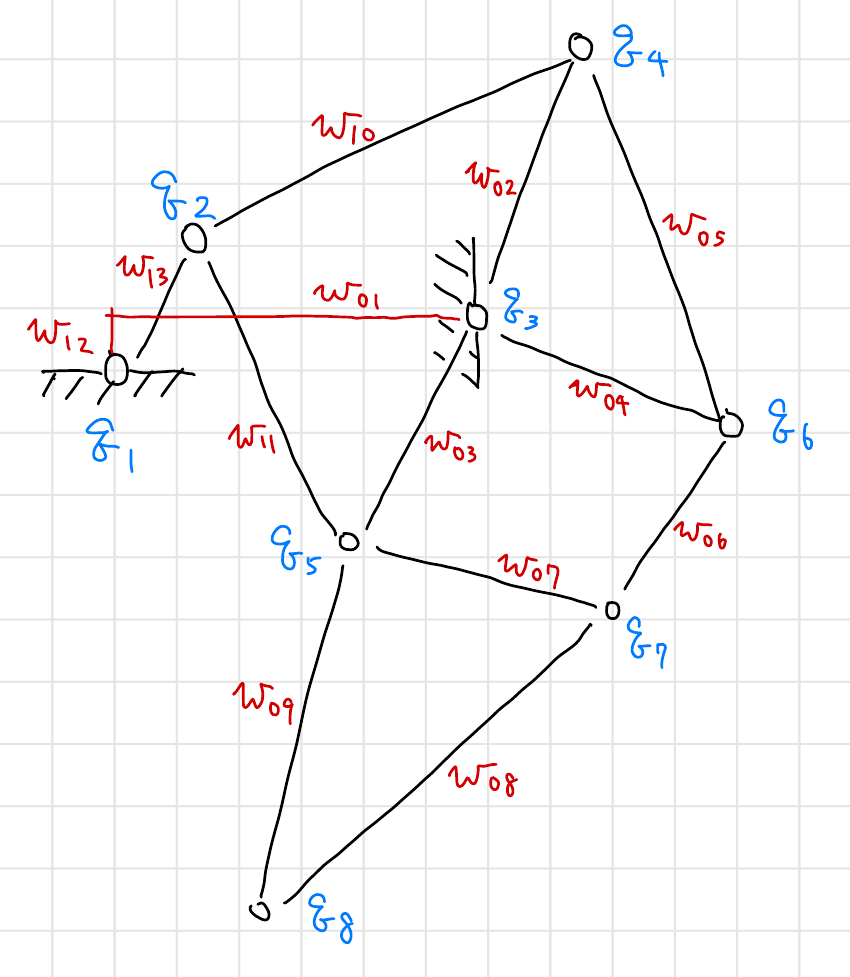
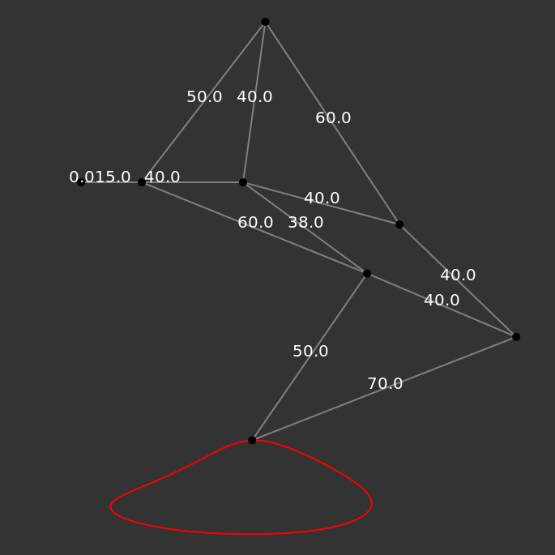
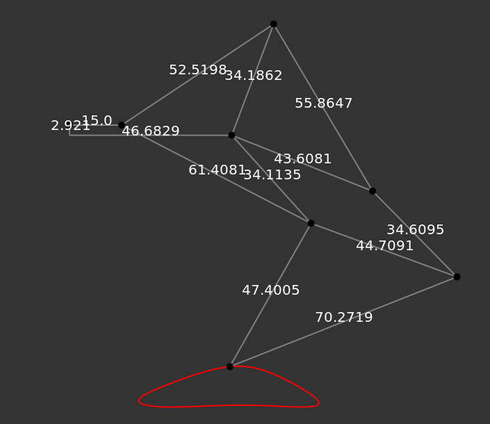

# Holy Numbers by MCMC

## Abstract
This repository treats optimization of the [holy numbers](https://www.youtube.com/watch?v=FFS-2axFo1Y) of the strand beest by [MCMC](https://en.wikipedia.org/wiki/Markov_chain_Monte_Carlo).



## Usage
### Load modules
```julia
push!(LOAD_PATH,".")
using HolyNumbersByMCMC
using Random
```

### Draw original linkage mechanism
```julia
w01 = 38.0
w02 = 41.5
w03 = 39.3
w04 = 40.1
w05 = 55.8
w06 = 39.4
w07 = 36.7
w08 = 65.7
w09 = 49.0
w10 = 50.0
w11 = 61.9
w12 = -7.8
w13 = 15.0

orig_holynumbers = HolyNumbers(w01,w02,w03,w04,w05,w06,w07,w08,w09,w10,w11,w12,w13)
draw("orig.gif", orig_holynumbers, showlength=true)
```


### Draw initial linkage mechanism
```julia
w01 = 40
w02 = 40
w03 = 38
w04 = 40
w05 = 60
w06 = 40
w07 = 40
w08 = 70
w09 = 50
w10 = 50
w11 = 60
w12 = 0
w13 = 15

orig_holynumbers = HolyNumbers(w01,w02,w03,w04,w05,w06,w07,w08,w09,w10,w11,w12,w13)
draw("init.gif", orig_holynumbers, showlength=true)
```


### Define some functions for MCMC

```julia
## Generate next holynumbers
function randnext(holynumbers::HolyNumbers)
    w01 = holynumbers.w01 + randn()/10
    w02 = holynumbers.w02 + randn()/10
    w03 = holynumbers.w03 + randn()/10
    w04 = holynumbers.w04 + randn()/10
    w05 = holynumbers.w05 + randn()/10
    w06 = holynumbers.w06 + randn()/10
    w07 = holynumbers.w07 + randn()/10
    w08 = holynumbers.w08 + randn()/10
    w09 = holynumbers.w09 + randn()/10
    w10 = holynumbers.w10 + randn()/10
    w11 = holynumbers.w11 + randn()/10
    w12 = holynumbers.w12 + randn()/10
    w13 = 15.0
    return HolyNumbers(w01,w02,w03,w04,w05,w06,w07,w08,w09,w10,w11,w12,w13)
end

## Energy function
function energy(holynumbers::HolyNumbers; n=90)
    try
        return energy(Locus(holynumbers, n=n))
    catch
        return Inf
    end
end

function energy(locus::Locus)
    E = 0.0
    n = length(locus)
    L,R,D,U = 0,100,-100,-50
    l,r,d,u = lrdu(locus)
    κ = curvature(locus)
    l < L && return Inf
    r > R && return Inf
    d < D && return Inf
    u > U && return Inf

    # Potential energy
    s = 0.0
    for q in locus
        s += (q.y - d)^(1/3)
    end
    E += s/n

    # Area
    E += (area(locus)-400)^2/20000

    # Limitation of curvature
    for i in 1:n
        -0.1 < κ[i] < 2 || return Inf
    end

    return E
end
```

### Optimize the holy numbers by MCMC (annealing)

```julia
Random.seed!(42)

holynumbers_log = iterate_mcmc(init_holynumbers, randnext, energy, 10000)
minimum(energy.(holynumbers_log))
best_holynumbers = bestsolution(holynumbers_log, energy)

holynumbers_log = iterate_mcmc(best_holynumbers, randnext, energy, 10000, β=2.0)
minimum(energy.(holynumbers_log))
best_holynumbers = bestsolution(holynumbers_log, energy)

holynumbers_log = iterate_mcmc(best_holynumbers, randnext, energy, 10000, β=4.0)
minimum(energy.(holynumbers_log))
best_holynumbers = bestsolution(holynumbers_log, energy)

holynumbers_log = iterate_mcmc(best_holynumbers, randnext, energy, 10000, β=8.0)
minimum(energy.(holynumbers_log))
best_holynumbers = bestsolution(holynumbers_log, energy)
```

### Draw the optimized linkage mechanism

```julia
draw("opt.gif", best_holynumbers, showlength=true)
```

